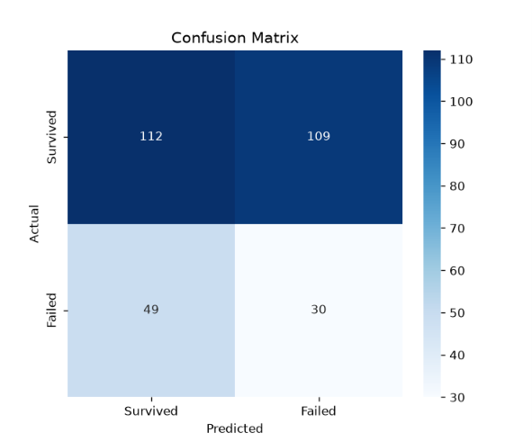
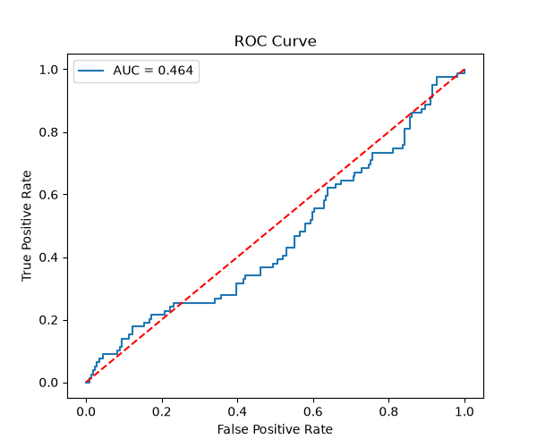

# Business Failure Prediction using Support Vector Machine (SVM)

# Project Overview

Business failure prediction plays an essential role in financial risk management. Banks, investors, auditors, and policymakers rely on accurate prediction models to identify financially distressed firms before failure occurs.

Traditional statistical techniques often struggle to model the complex and non-linear relationships that exist among financial indicators. Machine Learning techniques, particularly **Support Vector Machine (SVM)**, provide an effective alternative by constructing optimal decision boundaries capable of separating failed and non-failed firms.

This project develops an **SVM-based Business Failure Prediction Model** using financial ratios and evaluates its predictive performance through multiple classification metrics.

---

# Problem Statement

Financial institutions require reliable methods to identify firms likely to experience financial distress.

Conventional statistical models such as Logistic Regression and Discriminant Analysis often face limitations because:

- Financial variables are highly correlated.
- Business data is nonlinear.
- Class distributions are imbalanced.
- Decision boundaries overlap.

This project addresses these limitations using a **Support Vector Machine with Radial Basis Function (RBF) Kernel**.

---

# Objectives

The primary objectives of this study are:

- Predict whether a business will **Fail** or **Survive**
- Develop an SVM classification model
- Handle nonlinear financial relationships
- Optimize model performance using GridSearchCV for hyperparameter tuning
- Evaluate the classifier using multiple performance metrics
- Provide insights useful for financial risk assessment

---

# Dataset Description

The dataset contains financial information of **1,000 firms**.

## Features

### Liquidity Ratios

- Current Ratio
- Quick Ratio

### Profitability Ratios

- Return on Assets (ROA)
- Net Profit Margin

### Leverage Ratios

- Debt-to-Equity Ratio
- Interest Coverage Ratio

### Activity Ratio

- Asset Turnover

### Target Variable

Business_Failure

0 - Non Failed Firm
1 - Failed firm

---

# Machine Learning Workflow

The complete workflow consists of the following stages.

```
- Data Collection
- Data Cleaning
- Feature Selection
- Train-Test Split (70:30)
- Feature Scaling
  (StandardScaler)
- Support Vector Machine
  (RBF Kernel)
- Hyperparameter Optimization
  (GridSearchCV)
- Prediction
- Performance Evaluation

```
---

# Data Preprocessing

The following preprocessing steps were performed before model training.

- Removed unnecessary columns
- Checked missing values
- Converted target labels
- Feature scaling using **StandardScaler**
- Split dataset into training and testing datasets
- Training Set: **700 samples**
- Testing Set: **300 samples**

---

# Model Used

## Support Vector Machine (SVM)

Support Vector Machine is a supervised machine learning algorithm used for binary classification.

Instead of minimizing classification error directly, SVM maximizes the margin between two classes by constructing an optimal separating hyperplane.

This project uses the **Radial Basis Function (RBF)** kernel because financial ratios exhibit nonlinear relationships.

---

# Hyperparameter Optimization

GridSearchCV was used to obtain the optimal hyperparameters.

Best Parameters

```
Kernel : RBF

C : 10

Gamma : 0.1428
```

---

# Performance Metrics

The model was evaluated using:

- Accuracy
- Precision
- Recall
- F1 Score
- Confusion Matrix
- ROC Curve
- ROC-AUC Score

---

# Model Results

## Dataset Split

Training - 700
Testing - 300

---

## Classification Performance

 Accuracy -55.3% 
 F1 Score (Class 0) - 0.67 
 F1 Score (Class 1) - 0.33 
 ROC-AUC - 0.46 

---

# Confusion Matrix

The confusion matrix illustrates the number of correctly and incorrectly classified firms.




# ROC Curve

The Receiver Operating Characteristic (ROC) Curve evaluates the classifier's ability to distinguish between failed and non-failed firms.

ROC-AUC obtained: 0.46

```
Since the ROC-AUC value is close to **0.5**, the classifier exhibits limited discriminative capability.



---
```
# Libraries Used

- Pandas
- NumPy
- Matplotlib
- Seaborn
- Scikit-Learn
- OpenPyXL
```
```
# Results Interpretation

The model demonstrates moderate predictive performance.

### Strengths

- Successfully models nonlinear financial relationships.
- Effective use of RBF Kernel.
- Suitable as a preliminary financial risk assessment tool.
- Performs reasonably well in identifying non-failed firms.

### Weaknesses

- Poor prediction of failed firms.
- Low recall for financially distressed companies.
- ROC-AUC indicates weak class separation.
- Performance affected by class imbalance.

---

# Limitations

- Uses only financial ratio data.
- Ignores macroeconomic factors.
- Does not include qualitative business information.
- Historical financial data only.
- Limited feature set.
- Class imbalance reduces prediction quality.

---

# Future Scope

The predictive performance can be improved by:

- Applying SMOTE for class balancing.
- Using ensemble models such as Random Forest or XGBoost.
- Incorporating Deep Learning techniques.
- Including macroeconomic indicators.
- Adding qualitative corporate governance variables.
- Using time-series financial statements.
- Performing feature selection using Recursive Feature Elimination (RFE).

---

# Conclusion

This project successfully demonstrates the application of **Support Vector Machine (SVM)** for predicting business failure using financial ratios.

The RBF kernel effectively captures nonlinear relationships among financial indicators. Although the model achieves moderate classification performance, it predicts non-failed firms more accurately than failed firms. The results indicate that financial ratios alone are insufficient for highly accurate business failure prediction. Incorporating additional financial and non-financial variables, balanced datasets, and advanced machine learning techniques can substantially improve predictive performance.

Overall, this project provides a practical implementation of SVM for financial distress prediction and serves as a useful decision-support framework for investors, banks, and financial analysts.

---

# Author

**R.P.Keerthana**

PGDDSBA - Data Science and Business Analytics 

Thiagarajar School of Management,Madurai

---

# License

This project is developed for academic and educational purposes.
